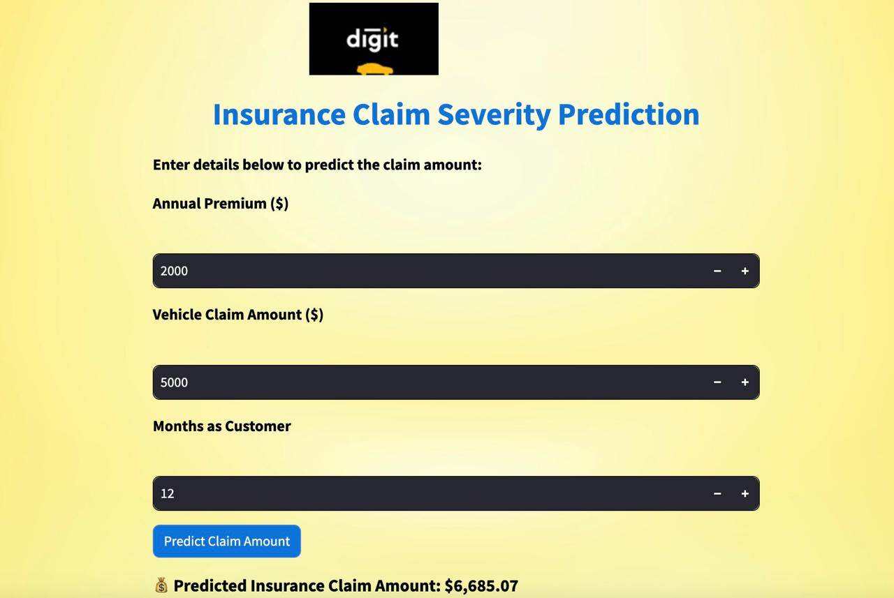

# Insurance Claim Severity Prediction

🚀 A machine learning-powered web app to predict insurance claim amounts, helping insurers optimize risk assessment and pricing strategies.

### ‼️ This project is an assessment case study for GoDigit, focusing on predicting insurance claim severity using machine learning. The dataset used in this analysis is hypothetical and sourced from publicly available datasets for educational and research purposes. All logos and brand names belong to their respective owners, and this project does not represent any real-world company.

## 📌 Overview

This project leverages historical insurance data to predict claim severity using machine learning models. It includes Exploratory Data Analysis (EDA), hypothesis testing, and model evaluation to derive insights that help insurers make data-driven decisions. A Streamlit-based web app is built for easy claim amount predictions.

## 🔍 Key Features

✅ Exploratory Data Analysis (EDA) – Visualizing trends in claim severity.

✅ Hypothesis Testing – Understanding key factors affecting claim amounts.

✅ Machine Learning Models – Training & evaluating regression models.

✅ Best Model Selection – Linear Regression chosen for highest accuracy.

✅ Web App Deployment – Built with Streamlit for real-time predictions.

## 🛠 Tech Stack

	•	Python (Pandas, NumPy, Scikit-learn, Matplotlib, Seaborn)
 
	•	Machine Learning (Linear Regression, Random Forest, XGBoost, Gradient Boosting)
 
	•	Hypothesis Testing (T-test for statistical significance)
 
	•	Streamlit (Interactive web app for claim prediction)

## 📊 Model Performance

Model 	MAE	 MSE	 R² Score

    • Linear Regression	 3440.47 	2.27e+07	 0.9658

    • Gradient Boosting	 3578.97 	2.48e+07	 0.9626

    • Random Forest	 3725.81 	2.67e+07 	0.9597

    • XGBoost	 4214.53	 3.19e+07	 0.9520

    • Decision Tree	 5262.40	 5.23e+07	 0.9212

✅ Best Model: Linear Regression (saved as insurance_claim_best_model.pkl)

## 💡 How to Use the Web App

- Clone the repository:

git clone https://github.com/your_username/Insurance-Claim-Severity-Prediction.git

cd Insurance-Claim-Severity-Prediction

- Run the Streamlit app:

streamlit run app.py

- Enter policy details and get predicted claim amount!

## 📌 Insights & Business Impact

- Helps insurers predict claim amounts more accurately.

- Enables better risk assessment & pricing strategies.

- Reduces fraud by identifying anomalous claim patterns.

- Enhances customer experience with faster claim estimates.

## 🔮 Future Scope

- Feature Engineering: Incorporate more policyholder data.

- Deep Learning Models: Explore advanced architectures.

- Cloud Deployment: Host on AWS/Azure/GCP for scalability.

- Fraud Detection: Add an anomaly detection module.
